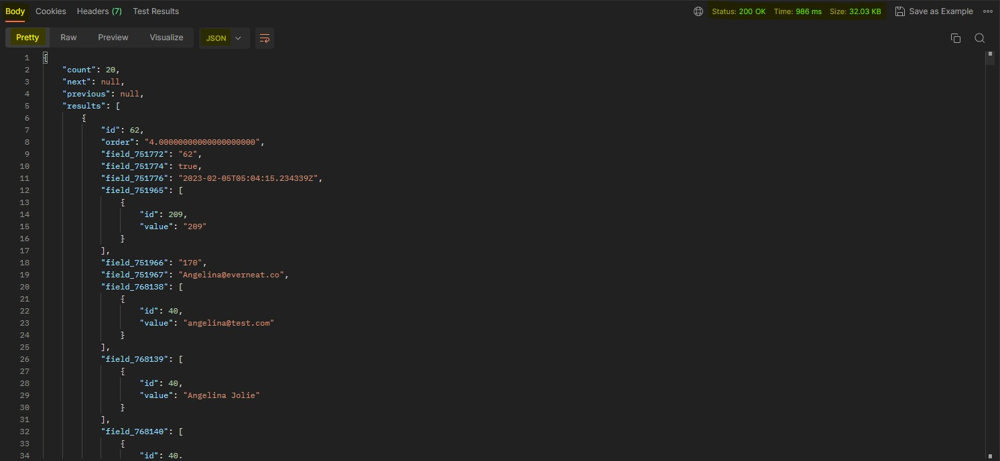
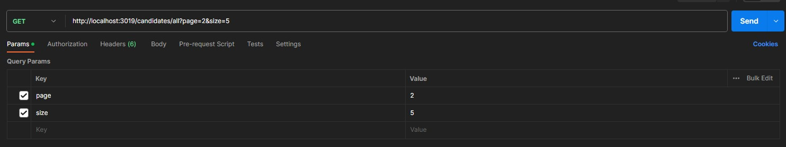

# Candidates

To list the rows in the candidates table, a `GET` request must be made to the `candidates` endpoint. The response is **paginated** and, by default, the first **page** is returned.

## Data Model Example



```json title="JSON BODY RESULT"
    {
    "count": 20, //Number of rows dymanic obtained
    "next": "http://api.baserow.io/api/database/rows/table/118042/?page=3&size=5", //Next page dymanic obtained
    "previous": "http://api.baserow.io/api/database/rows/table/118042/?page=1&size=5", //Previous page dymanic obtained
    "results": [
        {
            "id": 62,
            "order": "4.00000000000000000000",
            "field_751772": "62",
            "field_751774": true,
            "field_751776": "2023-02-05T05:04:15.234339Z",
            "field_751965": [
                {
                    "id": 209,
                    "value": "209"
                }
            ],
            "field_751966": "170",
            "field_751967": "Angelina@everneat.co",
            "field_768138": [
                {
                    "id": 40,
                    "value": "angelina@test.com"
                }
            ],
            "field_768139": [
                {
                    "id": 40,
                    "value": "Angelina Jolie"
                }
            ],
            "field_768140": [
                {
                    "id": 40,
                    "value": "Fairfield County"
                }
            ],
            "field_768141": [
                {
                    "id": 40,
                    "value": "No, I'm not a veteran"
                }
            ],
            "field_826075": {
                "id": 531180,
                "value": "Hired",
                "color": "dark-blue"
            },
            "field_845523": [
                {
                    "id": 40,
                    "value": "sample state"
                }
            ],
            "field_845525": [
                {
                    "id": 40,
                    "value": "1 - 2 years"
                }
            ],
            "field_845539": [
                {
                    "id": 40,
                    "value": "https://www.himalmag.com/wp-content/uploads/2019/07/sample-profile-picture.png"
                }
            ],
            "field_1007785": [
                {
                    "id": 14,
                    "value": "company2@test.com"
                }
            ],
            "field_1024105": [
                {
                    "id": 209,
                    "value": "Part Time"
                }
            ],
            "field_1024367": [
                {
                    "id": 40,
                    "value": {
                        "id": 529053,
                        "value": "Verified",
                        "color": "gray"
                    }
                }
            ],
            "field_1026493": [
                {
                    "id": 209,
                    "value": "Office cleaner 4"
                }
            ],
            "field_1026500": null,
            "field_1026501": null,
            "field_1026502": null,
            "field_1026503": null,
            "field_1053047": [
                {
                    "id": 40,
                    "value": {
                        "id": 554524,
                        "value": "No english",
                        "color": "dark-blue"
                    }
                }
            ],
            "field_1153538": [
                {
                    "id": 170,
                    "value": "170"
                }
            ],
            "field_1154615": [],
            "field_1189339": [
                {
                    "id": 14,
                    "value": "test"
                }
            ],
            "field_1189340": [
                {
                    "id": 14,
                    "value": "https://baserow-media.ams3.digitaloceanspaces.com/user_files/svxeBgxgjF0caolBX2mIXEYnM21yzhOl_16a138e2a2aa4aa0206f7cfe6f3630775d1a89dc219393f2df8466f0cb1d3f66.png"
                }
            ],
            "field_1189342": [
                {
                    "id": 14,
                    "value": {
                        "id": 317356,
                        "value": "Office / Commercial",
                        "color": "blue"
                    }
                }
            ],
            "field_1189395": [
                {
                    "id": 209,
                    "value": "Lima, Perú"
                }
            ]
        },
        // More rows go here...
    ]
}
```

## Endpoints Avaliables

### All

[Postman Request Link](https://www.postman.com/material-saganist-63603323/workspace/neatlist/request/26922125-1af53752-441d-4013-ad91-02495a2a4965)

```webmanifest title="Method: GET"
http://localhost:3019/candidates/all
```

#### All Model

```json title="List all candidates"
{
    "count": 20,
    "next": null,
    "previous": null,
    "results": [
        {
            "id": 62,
            "order": "4.00000000000000000000",
            "field_751772": "62",
            "field_751774": true,
            "field_751776": "2023-02-05T05:04:15.234339Z",
            "field_751965": [
                {
                    "id": 209,
                    "value": "209"
                }
            ],
            // More other rows go here...
        },
        // All results go here...
    ]
}
```

### Invited

[Postman Request Link](https://www.postman.com/material-saganist-63603323/workspace/neatlist/request/26922125-837063da-6f69-43f4-8f73-462232d203ab)

```webmanifest title="Method: GET"
http://localhost:3019/candidates/invited
```

#### Invited Model

```json title="List only invited candidates"
{
    "count": 1,
    "next": null,
    "previous": null,
    "results": [ 
        {
            "id": 111,
            "order": "10.00000000000000000000",
            "field_751772": "111",
            "field_751774": true,
            "field_751776": "2023-06-16T14:31:29.038872Z",
            "field_751965": [
                {
                    "id": 226,
                    "value": "226"
                }
            ],
            "field_826075": {   //This field shows candidate STAGE value
                "id": 695247,
                "value": "Invited",
                "color": "light-gray"
            },
        },
    ]
}
```

### Applied

[Postman Request Link](https://www.postman.com/material-saganist-63603323/workspace/neatlist/request/26922125-32a62725-f8bb-4d65-b91b-d3e36b50d251)

```webmanifest title="Method: GET"
http://localhost:3019/candidates/applied
```

#### Applied Model

```json title="List only applied candidates"
{
    "count": 14,
    "next": null,
    "previous": null,
    "results": [ 
        {
            "id": 103,
            "order": "10.00000000000000000000",
            "field_751772": "103",
            "field_751774": true,
            "field_751776": "2023-06-16T14:31:29.038872Z",
            "field_751965": [
                {
                    "id": 226,
                    "value": "226"
                }
            ],
            "field_826075": {   //This field shows candidate STAGE value
                "id": 531179,
                "value": "Applied",
                "color": "light-green"
            },
        },
    ]
}
```

### Interview

[Postman Request Link](https://www.postman.com/material-saganist-63603323/workspace/neatlist/request/26922125-8d4163f9-c85b-45da-bf71-e17c96dd030d)

```webmanifest title="Method: GET"
http://localhost:3019/candidates/interview
```

#### Interview Model

```json title="List only interview candidates"
{
    "count": 14,
    "next": null,
    "previous": null,
    "results": [ 
        {
            "id": 108,
            "order": "10.00000000000000000000",
            "field_751772": "108",
            "field_751774": true,
            "field_751776": "2023-06-16T14:31:29.038872Z",
            "field_751965": [
                {
                    "id": 226,
                    "value": "226"
                }
            ],
            "field_826075": {   //This field shows candidate STAGE value
                "id": 531184,
                "value": "Interview",
                "color": "light-orange"
            },
        },
    ]
}
```

### Test

[Postman Request Link](https://www.postman.com/material-saganist-63603323/workspace/neatlist/request/26922125-502f87b8-dc55-4359-bbed-2524fb751956)

```webmanifest title="Method: GET"
http://localhost:3019/candidates/test
```

#### Test Model

```json title="List only test candidates"
{
    "count": 14,
    "next": null,
    "previous": null,
    "results": [ 
        {
            "id": 110,
            "order": "10.00000000000000000000",
            "field_751772": "110",
            "field_751774": true,
            "field_751776": "2023-06-16T14:31:29.038872Z",
            "field_751965": [
                {
                    "id": 226,
                    "value": "226"
                }
            ],
            "field_826075": {   //This field shows candidate STAGE value
                "id": 531185,
                "value": "Test",
                "color": "dark-gray"
            },
        },
    ]
}
```

### Hired

[Postman Request Link](https://www.postman.com/material-saganist-63603323/workspace/neatlist/request/26922125-d204a51c-f024-452e-9c1c-ecdb83af3390)

```webmanifest title="Method: GET"
http://localhost:3019/candidates/hired
```

#### Hired Model

```json title="List only hired candidates"
{
    "count": 14,
    "next": null,
    "previous": null,
    "results": [ 
        {
            "id": 62,
            "order": "10.00000000000000000000",
            "field_751772": "62",
            "field_751774": true,
            "field_751776": "2023-06-16T14:31:29.038872Z",
            "field_751965": [
                {
                    "id": 226,
                    "value": "226"
                }
            ],
            "field_826075": {   //This field shows candidate STAGE value
                "id": 531180,
                "value": "Hired",
                "color": "dark-blue"
            },
        },
    ]
}
```

### Lead In

[Postman Request Link](https://www.postman.com/material-saganist-63603323/workspace/neatlist/request/26922125-f1ba2b24-7ae5-43a0-9c4c-0863653c4015)

```webmanifest title="Method: GET"
http://localhost:3019/candidates/leadin
```

#### Lead In Model

```json title="List only lead in candidates"
{
    "count": 14,
    "next": null,
    "previous": null,
    "results": [ 
        {
            "id": 63,
            "order": "10.00000000000000000000",
            "field_751772": "63",
            "field_751774": true,
            "field_751776": "2023-06-16T14:31:29.038872Z",
            "field_751965": [
                {
                    "id": 226,
                    "value": "226"
                }
            ],
            "field_826075": {   //This field shows candidate STAGE value
                "id": 531181,
                "value": "Lead In",
                "color": "light-orange"
            },
        },
    ]
}
```

### Rejected

[Postman Request Link](https://www.postman.com/material-saganist-63603323/workspace/neatlist/request/26922125-dfccf8a4-a0a5-4f78-a42f-9d8040717e3d)

```webmanifest title="Method: GET"
http://localhost:3019/candidates/rejected
```

#### Rejected Model

```json title="List only rejected candidates"
{
    "count": 14,
    "next": null,
    "previous": null,
    "results": [ 
        {
            "id": 104,
            "order": "10.00000000000000000000",
            "field_751772": "104",
            "field_751774": true,
            "field_751776": "2023-06-16T14:31:29.038872Z",
            "field_751965": [
                {
                    "id": 226,
                    "value": "226"
                }
            ],
            "field_826075": {   //This field shows candidate STAGE value
                "id": 531182,
                "value": "Rejected",
                "color": "orange"
            },
        },
    ]
}
```

## Query Params

The desired page can be obtained by providing the query parameters `page` and `size`.

Useful for making "Load More" buttons, infinite scrolls, etc.



:::tip

### Remember that symbols are important when entering parameters

Use **`?`** for the **first parameter**.

Use **`&`** for **all following parameters**.

Use **`=`** to declare **the value**.

:::

### Page

**Type:** `Integer`

**Default value:** 1

**Relevance:** Optional

:::info

The `page` parameter is used to separate the data by pages. And it defines which page of rows should be returned.

**Example:**

```webmanifest
http://localhost:3019/candidates/all?page=1
```

:::

### Size

**Type:** `Integer`

**Default value:** 100

**Relevance:** Optional

:::info

The `size` parameter defines how many rows should be returned per `page`.

**Example:**

```webmanifest
http://localhost:3019/candidates/all?size=5
```

:::

### Recomendations

:::caution

Normally the `page` parameter goes hand in hand with the `size` parameter.

Call first `page` and then `size` to obtain an optimal result.

**Example:**

```webmanifest
http://localhost:3019/candidates/all?page=2&size=5
```

:::

:::danger

Beware of using the **`page`** parameter if there are not enough results _(100+)_. You will get an error.

**Error:**

```json
{
    "error": "Error retrieving filtered rows"
}
```

:::
