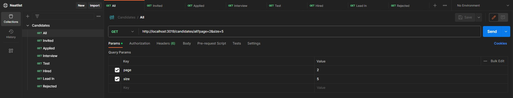

# Testing with some api platform

## Postman

Use this workspace created in postman to test the endpoints and see their results.

<https://www.postman.com/material-saganist-63603323/workspace/neatlist>

You should see something like this:

:::info

Remember to **download postman** in its **Client** or **Agent** version to be able to make requests to the localhost.

:::
